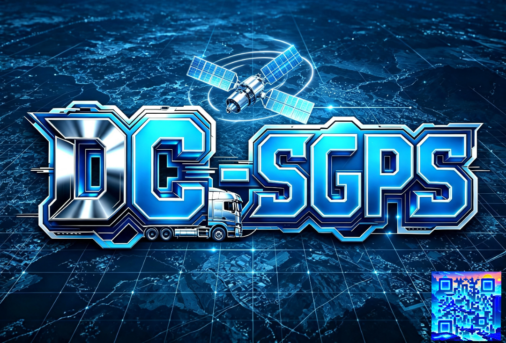
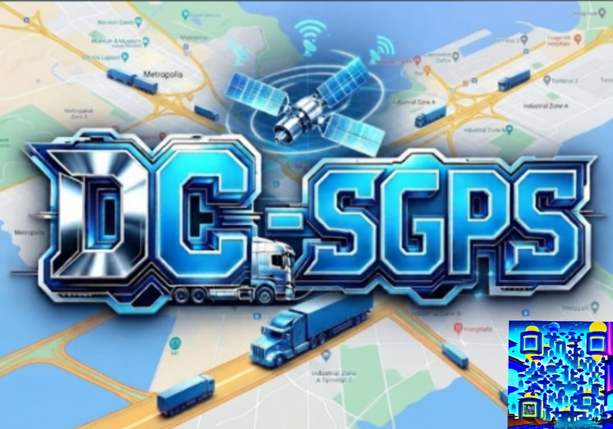

  

  

<h1 align="center">DC-SGPS</h1>

  <b>Servidor GPS Personalizado y Autohospedado en Termux (Android)</b>

---

## 📍 Acerca del Proyecto
**DC-SGPS** es una solución de rastreo GPS privada y optimizada, ejecutándose de forma persistente en entornos móviles Android mediante Termux, enlazada con dispositivos de telemetría y clientes móviles.

## 🚀 Acceso Rápido (QR)
Escanea el siguiente código QR para acceder rápidamente a la interfaz del servidor o enlazar tus dispositivos:

  

## ⚙️ Características
* Servidor de rastreo autohospedado con base de datos local.
* Automatización mediante alias rápido (`sgps`).
* Conectividad en tiempo real con clientes móviles y dispositivos de rastreo.
* Control de versiones y despliegue integrado en GitHub.

---

Desarrollado con 🚀 por DC Laboratory.

